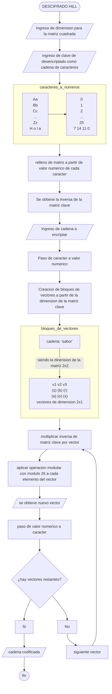
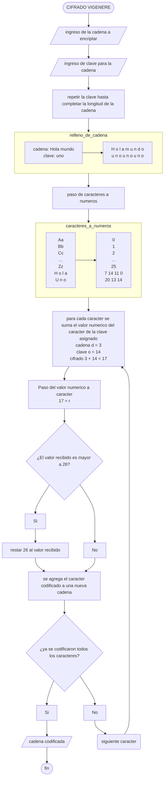
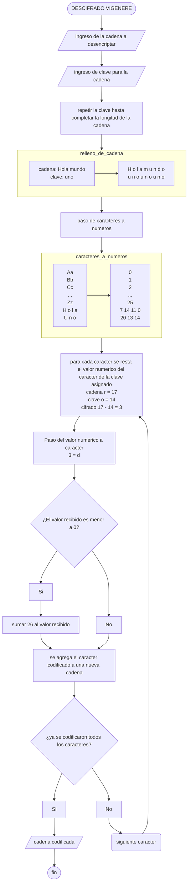

# Proyecto_PDC
Desarrollo del proyecto sobre encriptación de mensajes
## Cifrado Hill
Cifrado basado en operación modular, equivalencias de letras a números y operaciones de matrices

```mermaid
flowchart TD
    A([CIFRADO HILL])
    B[/Ingreso de dimension para la matriz cuadrada/]
    C[/ingreso de clave como cadena de caracteres/]
    G{¿la longitud de la cadena es igual a la cantidad de datos para la matriz?}
    H[Si]
    I[No]
    D[relleno de matriz a partir de valor numerico de cada caracter] 
    subgraph caracteres_a_numeros
    direction LR
    E["`Aa
    Bb
    Cc
    ...
    Zz
    H o l a`"]
    F["`0
    1
    2
    ...
    25
    7 14 11 0`"]
    E --> F
    end

    subgraph validez_de_matriz
    O[se obtiene el determinante de la matriz]
    P{¿el determinante es diferente de 0?}
    Q[Si]
    R[No]
    S[La matriz tiene inversa]
    O --> P
    P --> Q
    P --> R
    Q --> S
    end
    

    J[/Ingreso de cadena a encriptar/]
    K[Paso de caracter a valor numerico]
    L[Creacion de bloques de vectores a partir de la dimension de la matriz clave]
    subgraph bloques_de_vectores
    direction TB
    M[cadena: 'sabor']
    N["`v1  v2  v3
    (s)   (b)   (r)
    (a)   (o)   (x)
    vectores de dimension 2x1`"]
    M -- siendo la dinension de la matriz 2x2 --> N
    end
    T[multiplicar matriz clave por vector]
    U[aplicar operacion modular con modulo 26 a cada elemento del vector]
    V[/se obtiene nuevo vector /]
    W[paso de valor numerico a caracter]
    X{¿hay vectores restantes?}
    Y[Si]
    Z[No]
    AA[/cadena codificada/]
    AB([fin])
    AC[siguiente vector]

    A --> B
    B --> C
    C --> G
    C <--> R
    G --> H
    G --> I
    I --> C
    H --> caracteres_a_numeros
    caracteres_a_numeros --> D
    D --> validez_de_matriz
    S --> J
    J --> K
    K --> L
    L --> bloques_de_vectores
    bloques_de_vectores --> T
    T --> U
    U --> V
    V --> W
    W --> X
    X --> Y
    X --> Z
    Y --> AA
    AA --> AB
    Z --> AC
    AC --> T
```

Para el caso del desencriptado, se aplica inversa de matrices como paso adicional

## Cifrado vernam
Cifrado que se apoya en la operación XOR y equivalencias de letras a números, y que ademas, no posee un proceso para el desencriptado, puesto que mientras se tenga la msima clave de encriptado, se devolvera el mensaje original

## Cifrado Vigenere
El primer cifrado polialfabetico 

El descifrado se logra realizando el proceso inverso, suma a resta, y el limitante de 26 pasa a ser de 0

