# Proyecto_PDC
Desarrollo del proyecto sobre encriptación de mensajes. Este proyecto está orientado a la seguridad de envio de mensajes a travpes de cifrados de transposición, logicos y/o polialfabeticos a través de algoritmos de Python


## Diagrama General

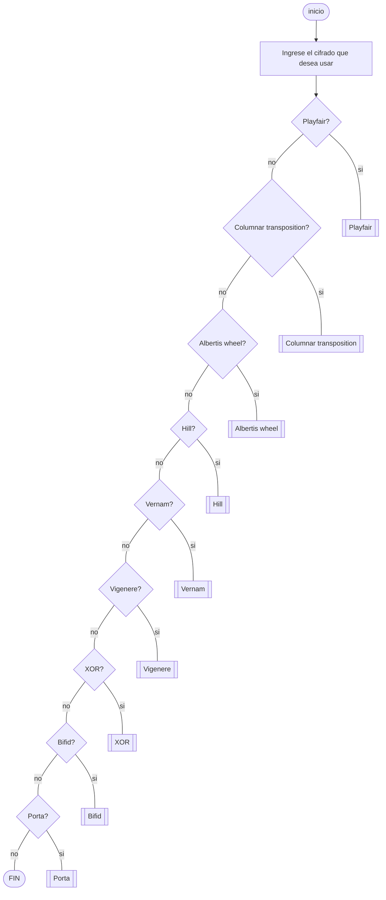
## Cifrado Hill
Cifrado basado en operación modular, equivalencias de letras a números y operaciones de matrices


Para el caso del desencriptado, se aplica inversa de matrices como paso adicional


## Cifrado Playfair
Este cifrado es de sustitución poligráfica, cifrando pares de letras en una matriz de 5x5 basada en una palabra clave

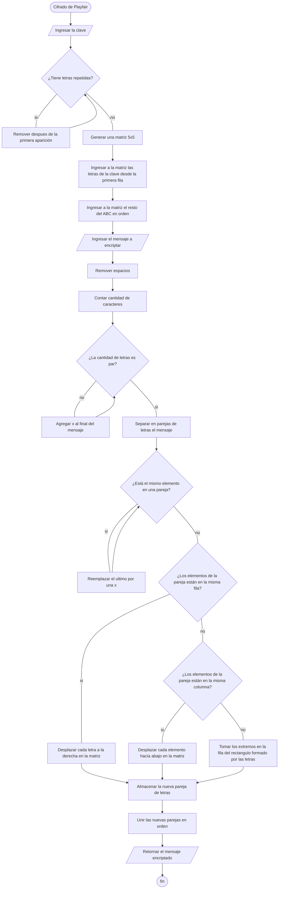
Por otro lado, su proceso de desencriptación es simplemente aplicar el mismo proceso pero deshaciendo los deplazamientos de los indices de las letras dentro de la matriz.
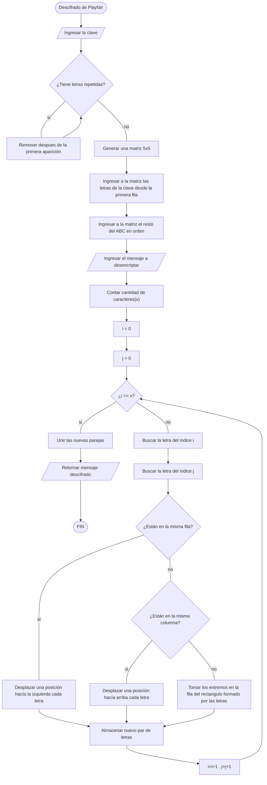
## Cifrado vernam
Cifrado que se apoya en la operación XOR y equivalencias de letras a números, y que ademas, no posee un proceso para el desencriptado, puesto que mientras se tenga la msima clave de encriptado, se devolvera el mensaje original

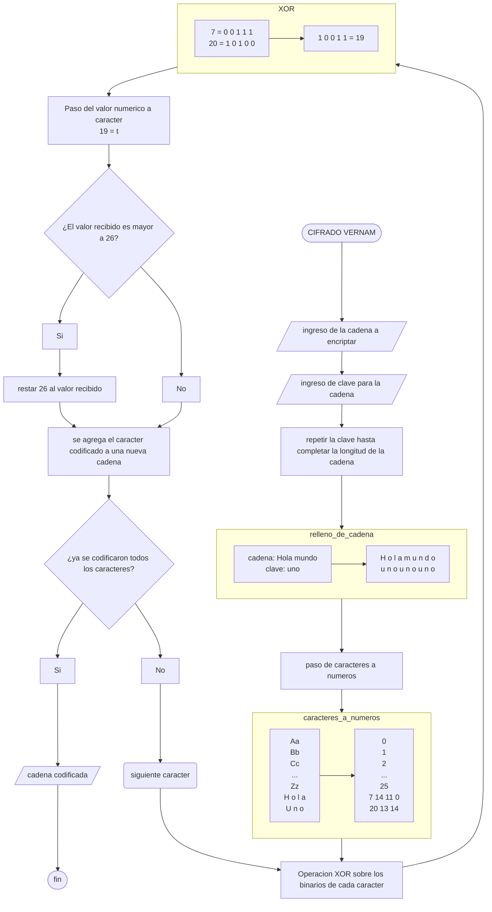
## Cifrado Alberti´s wheel
Es uno de los primeros cifrados polialfabeticos, consiste en dos discos (uno contenido en el otro) que poseen un conjunto de letras; la mayoría de veces es el alfabeto y algunos numeros. Para cifrar el mensaje se debe mover el disco interno según una serie de instrucciones dadas por el emisor.
Para el cifrado se tomaron ambos "discos" como cadenas de texto que van cambiando sus indices según los requisitos del usuario.
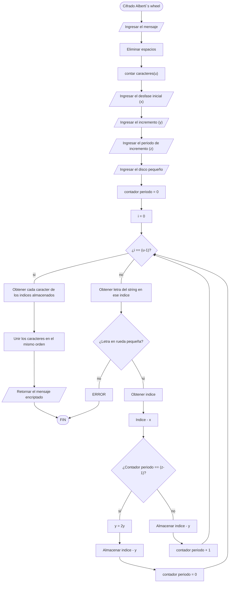
El descifrado sigue la misma lógica, la única condición es que hay que saber todas las instrucciones y el contenido del "disco pequeño". 
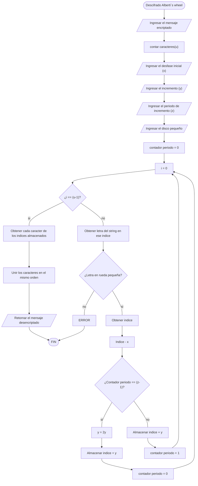

## Cifrado Vigenere
El primer cifrado polialfabetico 


El descifrado se logra realizando el proceso inverso, suma a resta, y el limitante de 26 pasa a ser de 0

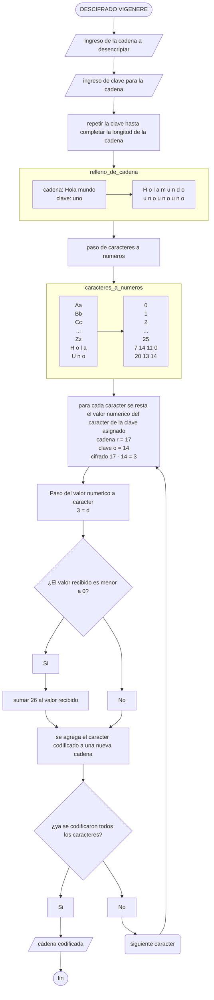
## Columnar Transposition
Este tipo de cifrado es de trasposición, donde las letras se reordenan según un esquema específico, en este caso es según el orden alfabético de la clave.
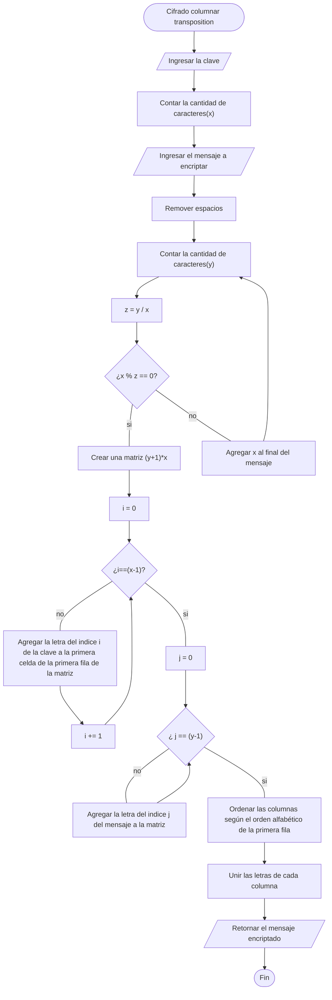
Su descifrado es simplemente revertir los pasos ya hechos, el único requisito es conocer la clave con la que fue cifrado el mensaje.
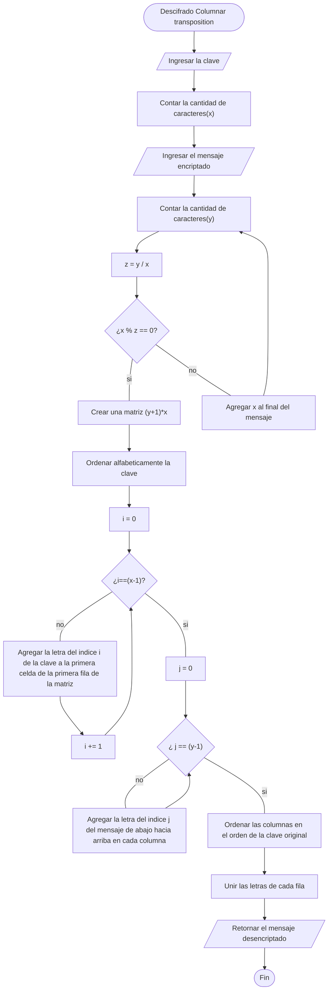
## XOR

Este cifrado usa la logica XOR entre un mensaje y una clave para cifrar el mensaje

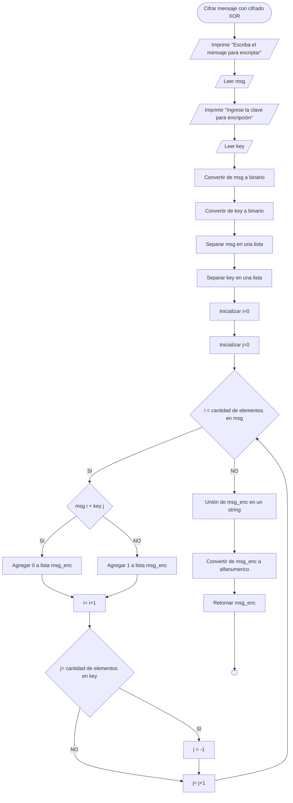

Para descifrar hay que inferir el bit original de acuerdi a la logica XOR

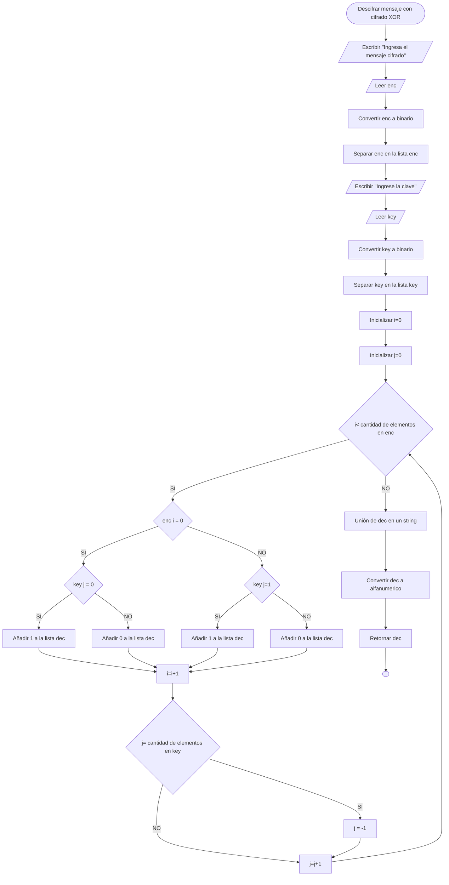

## Bifid

Cifrado por transposición utilizando la matriz de polybius como base

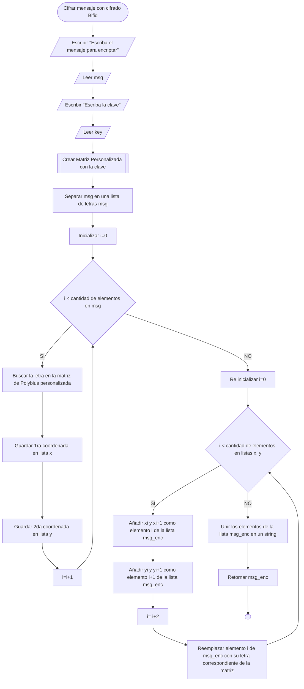

Se descifrado es simetrico, aunque la manera de operar el str ingresado original cambia

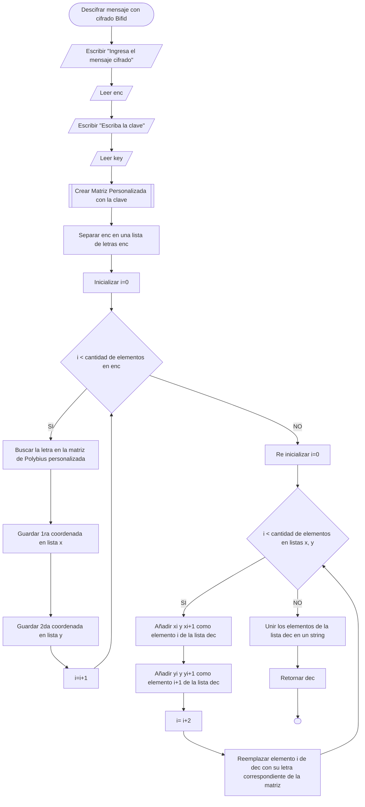

## Porta

Cifrado basado en varios abecedarios

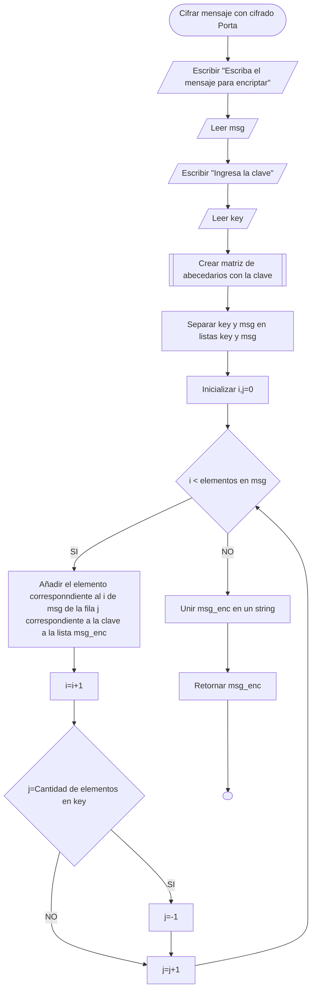

Su descifrado es simetrico pero el proceso de busqueda en las listas es inverso

   ```mermaid
           flowchart TD
        A([Descifrar mensaje con cifrado Porta]) --> B
        B[/Escribir "Escriba el mensaje cifrado"/]-->C
        C[/Leer enc/]-->D
        D[/Escribir "Ingresa la clave"/]-->E
        E[/Leer key/]-->FA
        FA[[Crear matriz de abecedarios con la clave]]-->F
        F[Separar key y enc en listas key y enc]-->G
        G[Inicializar i,j=0]-->H
        H{i < elementos en enc}
        H-- SI-->I
        H-- NO-->N
        I[Añadir el elemento corresponndiente al i de enc del abecedario original de acuerdo a la fila j de key a dec]-->J
        J[i=i+1]-->K
        K{j=Cantidad de elementos en key}
        K-- SI-->L
        K-- NO -->M
        L[j=-1]-->M
        M[j=j+1]-->H
        N[Unir dec en un string]-->O
        O[Retornar dec]-->P
        P([ ])
```
# ////////////////////////////////////////

```python
# CIFRADO VIGENERE

def caracter_a_numero(cadena:str) -> list:
    cadena.lower()
    cadena_conv = []
    for i in range (0,len(cadena)):
        if ord(cadena[i]) != 32:
            cambio = ord(cadena[i])-97
            match cambio:
                case 144:
                    cambio = 13
                case 128:
                    cambio = 0
                case 136:
                    cambio = 4
                case 140:
                    cambio = 8
                case 146:
                    cambio = 14
                case 153:
                    cambio = 20
                case 156:
                    cambio = 24
                case 134:
                    cambio = 2
            cadena_conv.append(cambio)
        else: 
            cadena_conv.append(" ")
    return cadena_conv

def numero_a_caracter(cadena:list) -> list:
    longitud = len(cadena)
    for i in range (0,longitud):
        if cadena[i] != " ":
            cadena.append(chr(cadena[i]+97))
        else:
            cadena.append(" ")
    for i in range (0, longitud):
        cadena.pop(0)
    return cadena

def vigenere (cadena:list, clave:list) -> list:
    cadena_vigenere : list = []
    j = 0
    for i in range(0, len(cadena)):
            ope = 0
            if cadena[i] != " ":
                ope = cadena[i] + clave[j]
                if ope > 25:
                    ope-= 26
                cadena_vigenere.append(ope)
                j += 1
            else:
                cadena_vigenere.append(" ")
            if j >= len(clave): 
                j = 0
    cadena_vigenere = numero_a_caracter(cadena_vigenere)
    cadena_vigenere = "".join(cadena_vigenere)
    return cadena_vigenere

if __name__ == "__main__":
    cadena : str = str(input("Por favor, ingrese el texto a cifrar: "))
    cadena_conv = caracter_a_numero(cadena)
    clave : str = str(input("Ahora, por favor ingrese la clave bajo la cual se cifrara el texto (una sola cadena sin espacios)"))
    clave_conv = caracter_a_numero(clave)
    cifrado =vigenere(cadena_conv, clave_conv)
    print(f"el texto codificado resultante a partir de la clave {clave} es:")
    print(cifrado)
```

```python
# DESCIFRADO VIGENERE

def caracter_a_numero(cadena:str) -> list:
    cadena.lower()
    cadena_conv = []
    for i in range (0,len(cadena)):
        if ord(cadena[i]) != 32:
            cambio = ord(cadena[i])-97
            match cambio:
                case 144:
                    cambio = 13
                case 128:
                    cambio = 0
                case 136:
                    cambio = 4
                case 140:
                    cambio = 8
                case 146:
                    cambio = 14
                case 153:
                    cambio = 20
                case 156:
                    cambio = 24
                case 134:
                    cambio = 2
            cadena_conv.append(cambio)
        else: 
            cadena_conv.append(" ")
    return cadena_conv

def numero_a_caracter(cadena:list) -> list:
    longitud = len(cadena)
    for i in range (0,longitud):
        if cadena[i] != " ":
            cadena.append(chr(cadena[i]+97))
        else:
            cadena.append(" ")
    for i in range (0, longitud):
        cadena.pop(0)
    return cadena

def des_vigenere (cadena:list, clave:list) -> list:
    cadena_vigenere : list = []
    j = 0
    for i in range(0, len(cadena)):
            ope = 0
            if cadena[i] != " ":
                ope = cadena[i] - clave[j]
                if ope < 0:
                    ope+= 26
                cadena_vigenere.append(ope)
                j += 1
            else:
                cadena_vigenere.append(" ")
            if j >= len(clave): 
                j = 0
    cadena_vigenere = numero_a_caracter(cadena_vigenere)
    cadena_vigenere = "".join(cadena_vigenere)
    return cadena_vigenere

if __name__ == "__main__":
    cadena : str = str(input("Por favor, ingrese el texto a descifrar: "))
    cadena_conv = caracter_a_numero(cadena)
    clave : str = str(input("Ahora, por favor ingrese la clave bajo la cual se descifrara el texto (una sola cadena sin espacios)"))
    clave_conv = caracter_a_numero(clave)
    cifrado =des_vigenere(cadena_conv, clave_conv)
    print(f"el texto decodificado resultante a partir de la clave {clave} es:")
    print(cifrado)
```
